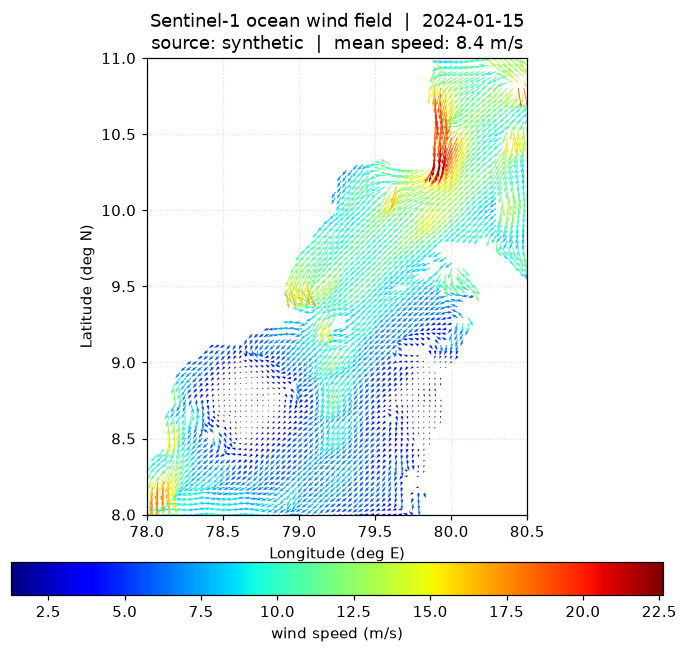

# Ocean Wind-Field Estimation from Sentinel-1 SAR

**API-based wind-field retrieval over Indian coastal areas (Tamil Nadu /
Gujarat) for offshore wind-farm planning.** Give the service a **date** and an
**area of interest** and it returns the corresponding ocean **wind-field
vectors** (speed + direction), derived from Sentinel-1 C-band SAR by inverting
the **CMOD5.N** geophysical model function, with wind direction estimated from
SAR wind-streak orientation (structure-tensor, plus an optional **ResNet**
deep-learning retriever).



> Works out-of-the-box with **no credentials** thanks to a physics-based
> Sentinel-1 synthetic source, and plugs into the real Copernicus Data Space
> when credentials are configured.

---

## Quickstart

This project targets **Python 3.10+** (it uses modern type-union syntax).

```bash
# 1. Create an environment (Python 3.10+)
python3.11 -m venv .venv && source .venv/bin/activate

# 2. Install
pip install -r requirements.txt

# 3. Run the API
python run.py                       # http://127.0.0.1:8000

# 4. Open the interactive map viewer
#    http://127.0.0.1:8000/          (redirects to /viewer/)
#    http://127.0.0.1:8000/docs      (Swagger UI)
```

### Try it from the command line

```bash
# Tamil Nadu coast, NE-monsoon day -> quiver map + GeoJSON
python -m windfield.cli --region tamilnadu --date 2024-01-15 \
        --grid-km 4 --png windfield.png --geojson windfield.json

# Gujarat coast with an explicit bounding box
python -m windfield.cli --bbox 68 20 70.5 22 --date 2024-06-25 --png guj.png
```

## API

| Method & path | Description |
|---|---|
| `GET /health` | Liveness + configuration probe |
| `GET /regions` | Available study-area presets |
| `POST /windfield` | Wind field (JSON) for a date + AOI |
| `GET /windfield` | Same, via query params |
| `GET /windfield.geojson` | Wind field as a GeoJSON `FeatureCollection` |
| `GET /windfield.png` | Rendered quiver map (arrows coloured by speed) |
| `GET /docs` | OpenAPI / Swagger UI |

### Request

`POST /windfield`

```json
{
  "date": "2024-01-15",
  "region": "tamilnadu",
  "grid_km": 4.0
}
```

Provide either a named `region` (`tamilnadu` | `gujarat`) **or** an explicit
`bbox`:

```json
{
  "date": "2024-06-25",
  "bbox": { "lon_min": 68.0, "lat_min": 20.0, "lon_max": 70.5, "lat_max": 22.0 },
  "grid_km": 3.0
}
```

### Response (excerpt)

```json
{
  "date": "2024-01-15",
  "bbox": { "lon_min": 78.0, "lat_min": 8.0, "lon_max": 80.5, "lat_max": 11.0 },
  "source": "synthetic",
  "grid_km": 4.0,
  "stats": { "n_vectors": 2995, "speed_min": 1.3, "speed_max": 22.6,
             "speed_mean": 8.4, "direction_mean": 40.2 },
  "vectors": [
    { "lon": 79.1, "lat": 9.4, "speed": 7.8, "direction": 41.0,
      "u": -5.1, "v": -5.9 }
  ]
}
```

* `speed` — 10 m neutral wind speed [m/s]
* `direction` — meteorological bearing the wind blows **from** [deg, 0 = N, CW]
* `u`, `v` — eastward / northward components [m/s]

Quick links (server running):

```
http://127.0.0.1:8000/windfield.png?date=2024-01-15&region=tamilnadu&grid_km=4
http://127.0.0.1:8000/windfield.geojson?date=2024-06-25&region=gujarat&grid_km=4
```

## How it works

```
date + AOI ─▶ Sentinel-1 sigma0 (VV)  ─▶  wind direction (streaks)  ─┐
                                                                     ├▶ CMOD5.N⁻¹ ─▶ wind speed
                          incidence + look geometry ─────────────────┘
                                          │
                       (u, v) + ocean mask + gridding ─▶ wind-field vectors
```

* **Wind speed** — invert the **CMOD5.N** GMF (`windfield/cmod5n.py`).
* **Wind direction** — structure-tensor orientation of band-pass-filtered wind
  streaks (`windfield/wind_direction.py`); optional ResNet CNN.
* **Land masking** — `global-land-mask`, so only ocean vectors are returned.

See [`docs/FINAL_REPORT.md`](docs/FINAL_REPORT.md) for the full methodology and
[`docs/VALIDATION.md`](docs/VALIDATION.md) for accuracy results.

## Data sources

| Source | When used | Notes |
|---|---|---|
| `synthetic` | default / fallback | Physics-based Sentinel-1 IW emulator (CMOD5.N forward + wind-streak texture + speckle). No credentials needed. |
| `copernicus` | when configured | Real Sentinel-1 GRD via the Copernicus Data Space Ecosystem. Needs credentials + `requirements-sentinel.txt`. Falls back to synthetic on any error. |

Configure real data by copying `.env.example` to `.env`:

```ini
CDSE_USERNAME=you@example.com
CDSE_PASSWORD=********
WINDFIELD_SOURCE=auto      # auto | synthetic | copernicus
```

## Optional: ResNet wind-direction model

```bash
pip install -r requirements-ml.txt
python -m windfield.ml.train --epochs 8 --steps 200   # -> windfield/ml/weights/resnet_direction.pt
```

Once a checkpoint exists, the `resnet` retriever is used automatically; without
it the system uses the structure-tensor method.

## Validation

```bash
python -m windfield.validation     # prints the accuracy table
```

Closed-loop synthetic round-trip (3 km grid): wind-speed RMSE ≈ 0.5 m/s
(corr ≈ 0.99), wind-direction RMSE ≈ 30 deg.

## Tests

```bash
pip install pytest
pytest                              # 15 tests: CMOD5.N, estimator, API
```

## Docker

```bash
docker build -t ocean-windfield .
docker run -p 8000:8000 ocean-windfield
```

## Project layout

```
windfield/
  cmod5n.py            CMOD5.N forward + inverse GMF
  sar_source.py        Sentinel-1 acquisition (synthetic + Copernicus)
  wind_direction.py    structure-tensor + ResNet direction retrieval
  ml/                  optional PyTorch ResNet + training
  geo.py               gridding, ocean mask, (speed,dir)<->(u,v)
  estimator.py         end-to-end orchestration
  visualize.py         quiver-map rendering
  api/app.py           FastAPI service
  validation.py        synthetic round-trip validation
  cli.py               command-line interface
frontend/index.html    Leaflet wind-field viewer
docs/                   final report + validation results
tests/                  pytest suite
```

## References

1. Wind direction retrieval from Sentinel-1 SAR images using ResNet, *Remote
   Sensing of Environment* (2021) —
   <https://www.sciencedirect.com/science/article/pii/S0034425720305514>
2. ESA SNAP Microwave Toolbox — Wind Field Estimation — <https://step.esa.int/main/>
3. CMOD5.N GMF (KNMI) — <https://scatterometer.knmi.nl/cmod5/>
4. CMOD5.N Python reference, *openwind* (NERSC) —
   <https://github.com/nansencenter/openwind>

## License

MIT (see project metadata). The CMOD5.N coefficients are part of the published
geophysical model and are in the public domain.
